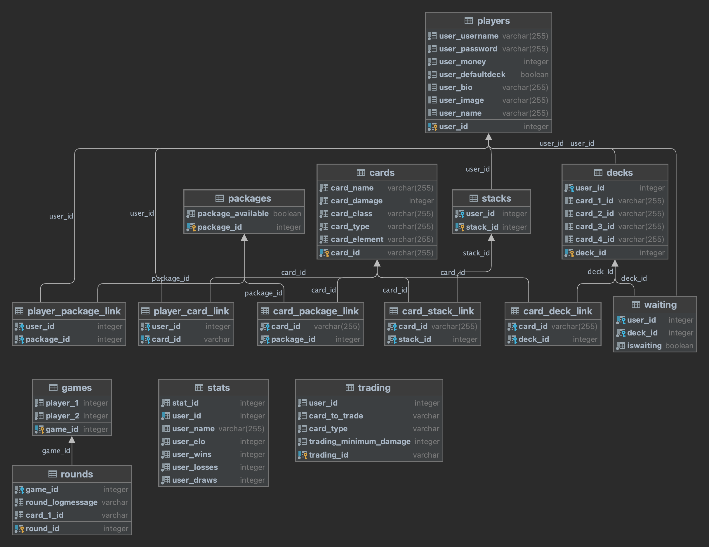
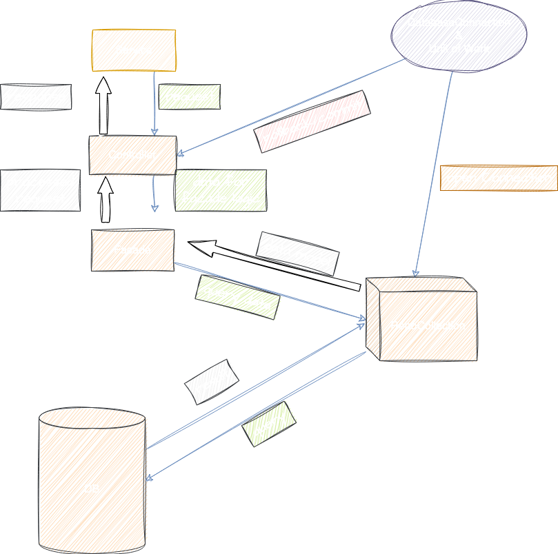

# Setup: Start Database

```shell
#!/bin/bash
echo "Starting Database"
echo -e "\n"
sudo docker stop swe1db
sudo docker rm swe1db
sudo docker run --name swe1db -e POSTGRES_USER=swe1user -e POSTGRES_PASSWORD=swe1pw -p 5432:5432 postgres
```
Für die Datenspeicherung wird eine PostgresSQL Datenbank verwendet, die auf einem Docker Container läuft.

# Backend Design

## Tabellen



## Backend LogicStructure

HTTP requests werden vom Server aufgenommen und an das dazugehörende Service weitergeleitet. 
Dieses Service leitet den Request an einen Controller weiter. Dieser ist am Anfang in erster Linie für die Authentifizierung verantwortlich.
Im nächsten Schritt sendet der Controller die notwendigen Request Daten weiter and die Facade. Die Facade ist für jegliche Form von Logic verantwortlich,
die ausgeführt werden muss, bevor eine Query an die Datenbank stattfinden kann. Darunter zählen:

- hat ein User genügend Geld
- existiert ein Benutzer schon
- hole für jede Card_id das dazugehörige Card Objekt

<br>
Wenn die Logic ausgeführt wurde, finden die DB Requests statt. In der RepoCollection sind alle notwendigen Aufrufe
für alle Tabellen. Sie wird von der Facade aufgerufen und bekommt die DB Verbindung über die DatabaseConnection, die auch 
gleichzeitig als "Unit of Work" dient.
<br>
Schließlich sendet die Facade entweder einen Boolean oder andere Daten an den Controller, der abhängig vom Verlauf, verschiedenste Fehler/Erfolgsnachrichten and den Client sendet.
Sollte etwas schiefgegangen sein, findet ein rollback statt. 



# Unit Tests und Curl Script

Ich habe entschieden Unit-Tests vor allem für die Spiellogik zu machen, da diese nicht vom CURL-Script abgedeckt werden.
Da wird beispielsweise überprüft, ob der Schaden richtig kalkuliert wurde, oder der User nach einem Sieg die richtige Elo-Anzahl zurückbekommt.
# Lessons learned

Da dies mein erstes Java Projekt war, fand ich den Anfang relativ holprig. Es hat gedauert bis ich mich an die Methoden des objektorientierten Programmierens gewöhnt.
Außerdem musste ich mein Datenmanagement Wissen wieder auffrischen, da dies ein sehr großer Bestandteil des Projekts war.
<br>
Eine ebenfalls große Hürde war die Planung. Ich hatte bisher noch kein Projekt mit diesem Umfang und konnte deshalb schwer im Oktober voraussagen, was ich Ende Januar 
brauchen würde. Ich habe sehr oft große Teile des Backends um- bzw. neugeschrieben, was oft wiederum zu anderen unerwarteten Fehlern gefühlt hat.
<br>
Trotzdem habe ich vieles, vor allem was Planung betrifft, gelernt. Ich habe gelernt, dass man sich Zeit lassen soll, um guten Code zu schreiben. Wenn man etwas richtig macht,
muss man es kein zweites Mal machen.

# Aufwand

Ich habe für das gesamte Projekt ungefähr 100-120 Stunden für dieses Projekt gebraucht. Davon waren wahrscheinlich 50 Stunden dem debugging gewidmet.

# Version Control System
Ich habe während meines Projekts Github für die Versionsverwaltung verwendet.
<br>
Das Semesterprojekt ist hier zu finden: 
[GitHub Projekt Link](https://github.com/israeltshilumbaFHTW/MTCG)